# Daily Options Data 2026-07-08

## TSM $431.00 -1.57 (-0.36%)

### Jul 10, 2026

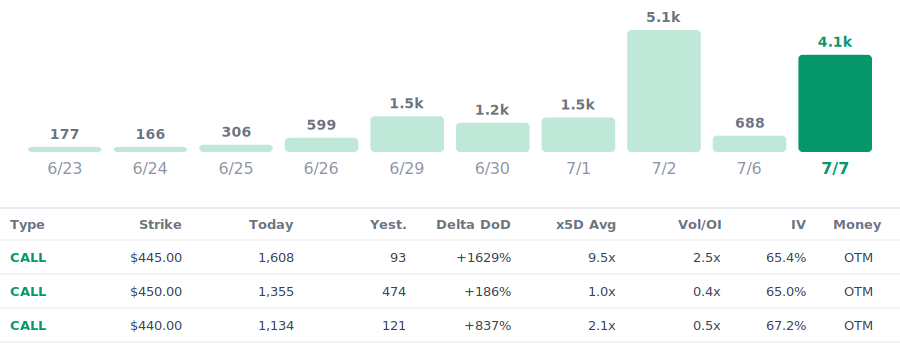

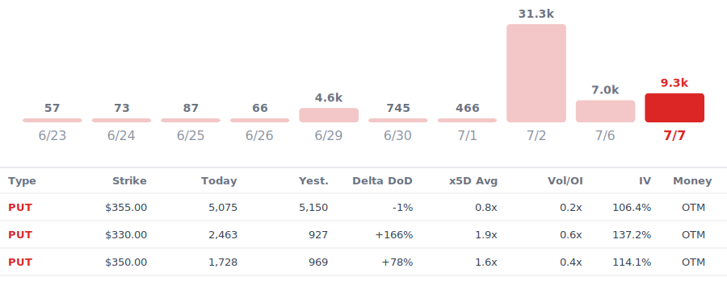

### Jul 17, 2026

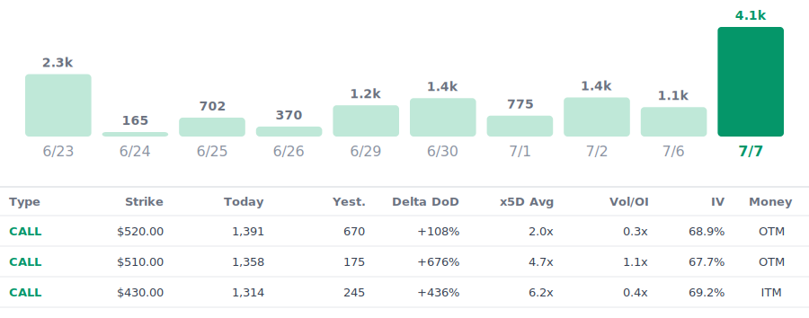

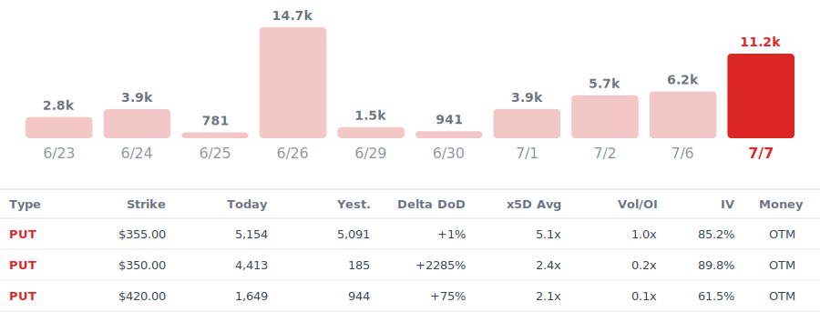

### Jul 24, 2026

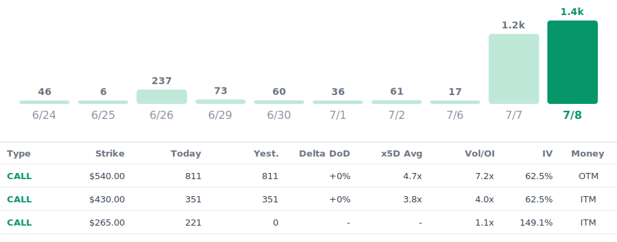

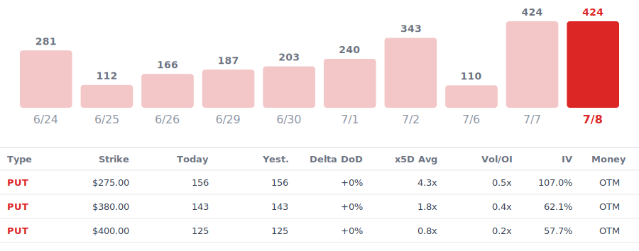

## ASML $1735.19 -12.09 (-0.69%)

### Jul 10, 2026

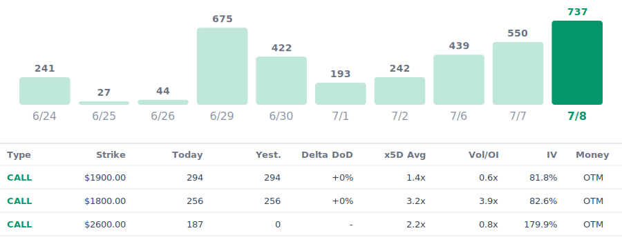

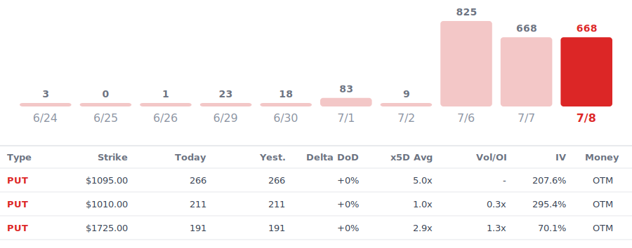

### Jul 17, 2026

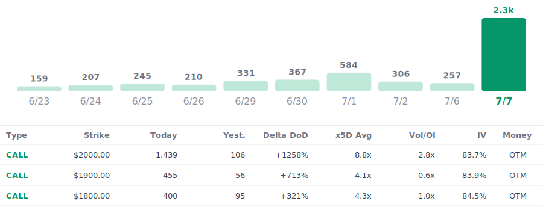

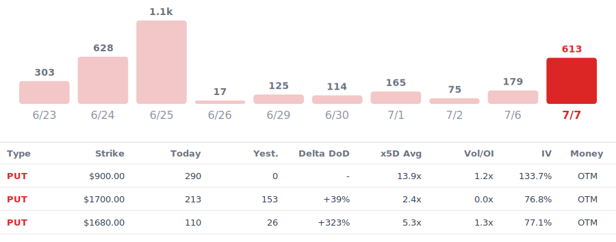

### Jul 24, 2026

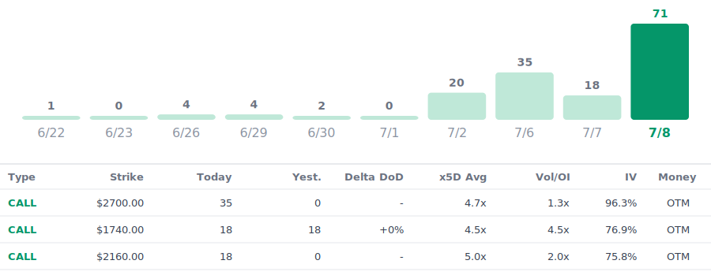

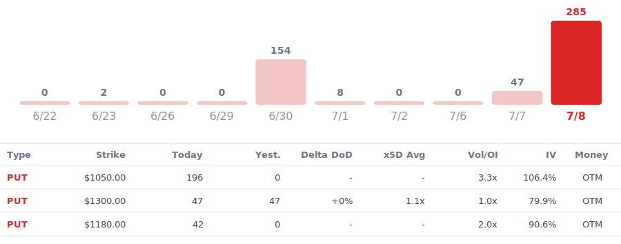

